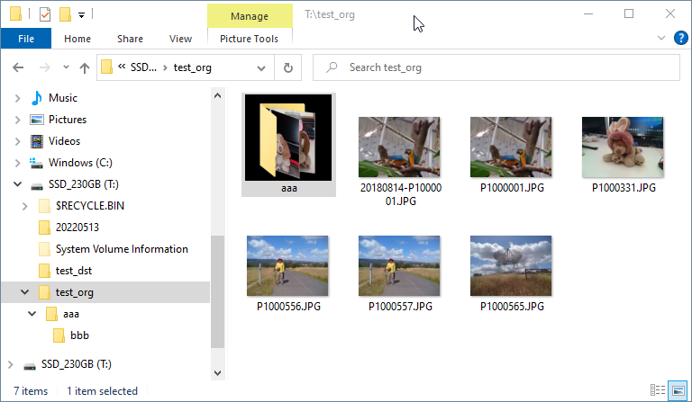
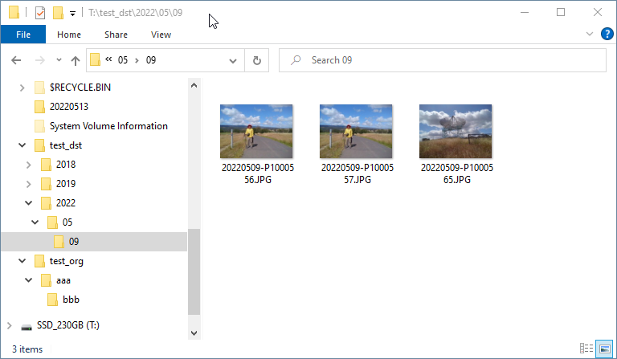
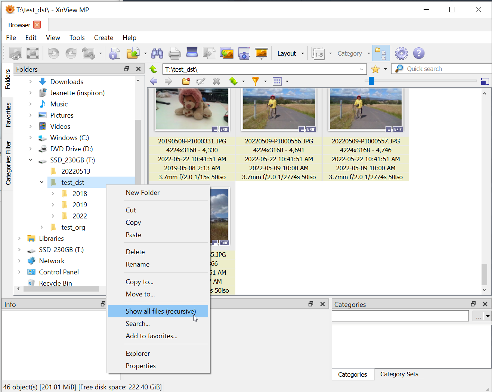

# organize_rename_file.py

File organizer with adding 8-digit date prefix and YYYY/MM/DD folder structure.

It is similar to Adobe Lightroom Classic import feature.

The purpose of this program is to organize files compatible with Lightroom when Lightroom is not available.

(I prefer to use Lightroom, but in some cases it is not available.)

## Usage

python organize_rename_file.py original_folder_path destination_folder_path

ex) python organize_rename_file.py C:/temp/org C:/temp/dst

## Example

Original folder 
IMG0001.JPG (modified date: 2022-01-23)

Destination folder 
/2022/01/23/20220123_IMG0001.JPG

Original folder 

Destination folder 

## Python compatibility
Code is tested on Python 3.8.5 on Windows 10 only.

## Convenient usage with XnView MP

XnView MP can show all subfolder images by selecting "Show all files (recursive)".

It makes similar usage of Lightroom Classic.

## Note

As I wrote this code in good intention, but this program does not have any warranty or
 
So please handle it with care.

Commented code has moving instead of copying, and some variations.